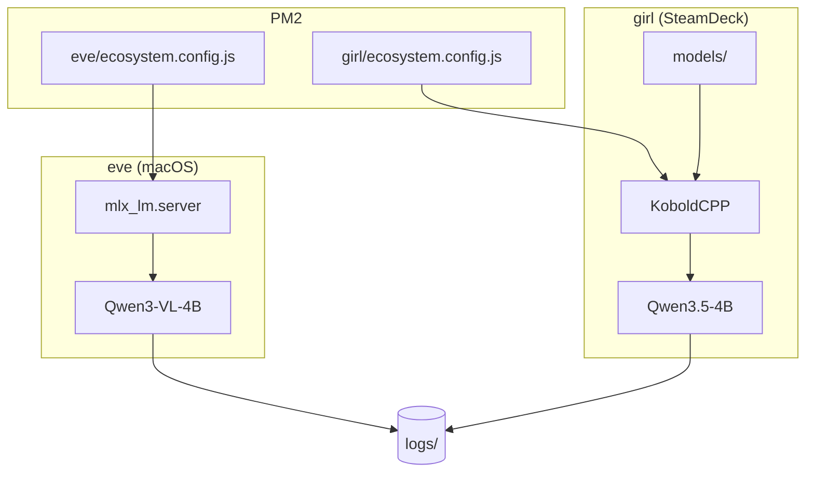

# 🤖 Local LLM Manager

PM2로 관리하는 Local LLM 서버 설정입니다.

## 📐 1. 아키텍처



## 📁 2. 파일 구조

```
.
├── eve/                        # 🍎 macOS 서버
│   ├── ecosystem.config.js
│   └── .env
├── girl/                       # 🎮 SteamDeck 서버
│   ├── ecosystem.config.js
│   ├── pm2.service             # systemd user service
│   ├── .env
│   └── models/                 # 모델 파일 (gitignore)
├── logs/                       # 📋 공통 로그
└── README.md
```

## 🖥️ 3. 서비스

| 서버 | 이름 | 모델 | 포트 |
|------|------|------|------|
| 🍎 eve | Qwen3-VL-4B | mlx-community/Qwen3-VL-4B-Instruct-4bit | 58081 |
| 🎮 girl | Qwen3.5-4B | Qwen3.5-4B-Q5_K_M.gguf | 58081 |

## 🚀 4. 빠른 시작

### 4-1. 저장소 클론

```bash
git clone <repo-url> ~/git/local-llm-manager
cd ~/git/local-llm-manager
```

### 4-2. 서버별 설정

**🍎 eve (macOS):**
```bash
cd ~/git/local-llm-manager/eve
cp .env.example .env   # 필요시 생성
pm2 start ecosystem.config.js
pm2 save
```

**🎮 girl (SteamDeck):**
```bash
cd ~/git/local-llm-manager/girl
# 모델 파일이 이미 models/에 있어야 함
pm2 start ecosystem.config.js
pm2 save
```

### 4-3. 부팅 시 자동 시작

**🍎 eve (macOS):**
```bash
pm2 startup            # startup 스크립트 생성 (안내 따라 실행)
pm2 save               # 현재 상태 저장
```

**🎮 girl (SteamDeck) - systemd user service:**

> **왜 필요한가?** SteamDeck에서 `pm2 start`로 실행하면 SSH 세션 종료 시 SIGHUP signal이 전파되어 PM2 daemon이 함께 종료됩니다. systemd user service로 등록하면 세션과 무관하게 PM2가 유지됩니다.

```bash
# 1. 심볼릭 링크 생성
ln -sf ~/git/local-llm-manager/girl/pm2.service ~/.config/systemd/user/pm2.service

# 2. PM2 서비스 시작 및 상태 저장
cd ~/git/local-llm-manager/girl
pm2 start ecosystem.config.js
pm2 save

# 3. systemd 서비스 활성화
systemctl --user daemon-reload
systemctl --user enable pm2.service
systemctl --user start pm2.service

# 4. 상태 확인
systemctl --user status pm2.service
pm2 list
```

## ⌨️ 5. 자주 쓰는 명령어

```bash
# ▶️ 서비스 시작/중지/재시작
pm2 start <service-name>
pm2 stop <service-name>
pm2 restart <service-name>

# 📊 상태 확인
pm2 status
pm2 monit              # 실시간 모니터링

# 📋 로그
pm2 logs               # 전체 로그
pm2 logs <service-name> --lines 50   # 특정 서비스 최근 50줄

# 💾 저장/복원
pm2 save               # 현재 상태 저장
pm2 resurrect          # 저장된 상태 복원
pm2 delete all         # 전체 삭제 (주의)
```

## 📦 6. 모델 파일 관리

모델 파일은 `<server>/models/`에 위치합니다.

```bash
# girl 서버에 모델 다운로드 예시
cd ~/git/local-llm-manager/girl/models
# GGUF 모델 다운로드
wget https://huggingface.co/.../Qwen3.5-4B-Q5_K_M.gguf
```

## 📋 7. 로그 관리

- **위치**: `./logs/`
- **Rotate**: 10MB 초과 시 자동 rotate, 최대 3개 파일 유지 (압축)

**pm2-logrotate 설정** (`~/.pm2/module_conf.json`):

```json
{
  "pm2-logrotate": {
    "max_size": "10M",
    "retain": "3",
    "compress": true,
    "dateFormat": "YYYY-MM-DD_HH-mm-ss",
    "workerInterval": "30",
    "rotateInterval": "0 0 * * *",
    "rotateModule": true
  }
}
```

## 🔧 8. 문제 해결

### ❌ 서비스가 시작되지 않을 때
```bash
pm2 logs <service-name> --err    # 에러 로그 확인
pm2 describe <service-name>      # 상세 정보 확인
```

### 🔌 포트 충돌
```bash
lsof -i :58081                   # 포트 사용 확인
```

### 💾 메모리 부족
```bash
pm2 monit                        # 메모리 사용량 확인
# ecosystem.config.js에서 max_memory_restart 조정
```

## ➕ 9. 새 서버 추가

1. `<new-server>/` 폴더 생성
2. `ecosystem.config.js` 작성 (기존 파일 복사 후 수정)
3. `.env` 파일 생성 (필요시)
4. `models/` 폴더 생성 및 모델 다운로드 (로컬 모델 사용시)
5. PM2 시작 및 저장

```bash
mkdir -p new-server
cp eve/ecosystem.config.js new-server/
# 설정 파일 수정
pm2 start new-server/ecosystem.config.js
pm2 save
```
