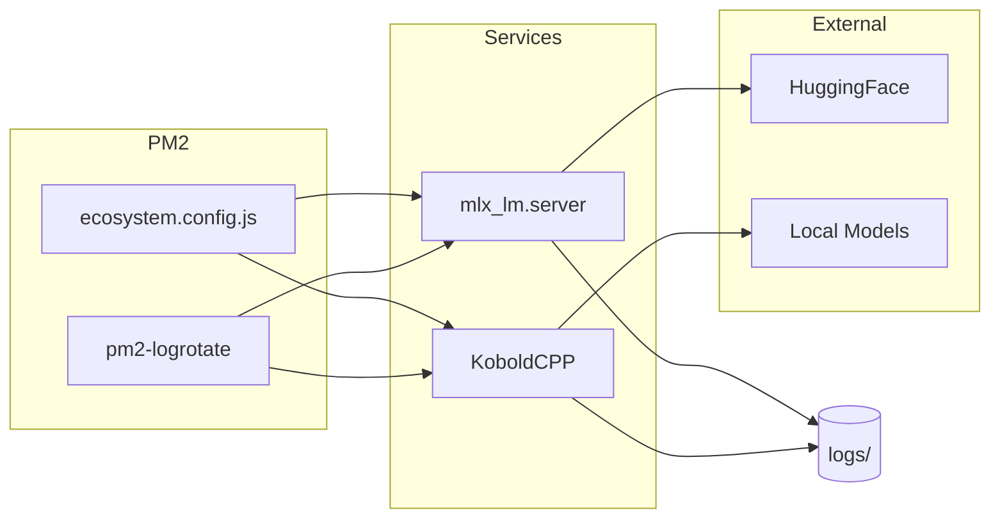

# Local LLM Server

PM2로 관리하는 Local LLM 서버 설정입니다.

## 1. 아키텍처



## 2. 파일 구조

```
.
├── ecosystem.config.js   # PM2 설정
├── .env                  # 환경변수
├── .gitignore
├── README.md
└── logs/                 # 로그 디렉토리
    └── *.log
```

## 3. 서비스

| 이름 | 모델 | 포트 |
|------|------|------|
| qwen3-vl-4b | mlx-community/Qwen3-VL-4B-Instruct-4bit | 58081 |

## 4. 사용법

```bash
# 서버 시작
pm2 start ecosystem.config.js

# 상태 확인
pm2 status

# 로그 확인
pm2 logs qwen3-vl-4b

# 재시작
pm2 restart qwen3-vl-4b

# 중지
pm2 stop qwen3-vl-4b

# PM2 상태 저장 (재부팅 시 복원용)
pm2 save
```

### 4.1 로그

- **위치**: `./logs/`
- **Rotate**: 10MB 초과 시 자동 rotate, 최대 3개 파일 유지 (압축)

**pm2-logrotate 설정** (`~/.pm2/module_conf.json`):

```json
{
  "pm2-logrotate": {
    "max_size": "10M",
    "retain": "3",
    "compress": true,
    "dateFormat": "YYYY-MM-DD_HH-mm-ss",
    "workerInterval": "30",
    "rotateInterval": "0 0 * * *",
    "rotateModule": true
  }
}
```

### 4.2 모델 추가

`ecosystem.config.js`의 `apps` 배열에 새 항목을 추가합니다:

```javascript
{
  name: 'new-model',
  script: `${LOCAL_BIN_PATH}/mlx_lm.server`,
  args: [
    '--model <model-path>',
    '--host 0.0.0.0',
    '--port <port>',
  ].join(' '),
  interpreter: 'none',
  log_date_format: 'YYYY-MM-DD HH:mm:ss',
  merge_logs: true,
  error_file: './logs/new-model.log',
  out_file: './logs/new-model.log',
  env_file: '.env',
  max_memory_restart: '8G',
  autorestart: true,
},
```
